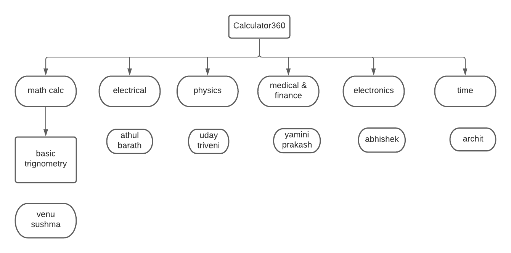

# Daily Stand Up

## Call 1 - 19th August 2021 (7:59-8:58)

### **Agenda** : Planning the project and discussion about requirement analysis

The meeting started with introduction of team members. We added ideas for the name for the project and the function provided by the project. We came up with a calculator which can perform various calculations and conversion across all subjects. We discussed on how the project should be divided. We divided the project work into different sub sections and each person took their deisred task from it.

Next we discussed on how requirements should be done.We divided each part of requirements to the team members. We ended the meeting by fixing a deadline for completion of the requirements.

## Call 2 - 20th August 2021 (6:19-7:48)

### **Agenda** : Design and testplanning

The meeting started with how far we have reached. We then discussed about design plans and how to work on it. Uday took up the initiative to creating high level design while the low level design was planned to be added by each team member. We then discussed about the Test plans. Venu took up the initiative for creating High level test plan while each team member was asked to add their low level test plans in the table. We ended the meeting by talking briefly about the implementation part and fixing the deadline for the completion of the tasks.

## Call 3 - 23rd August 2021 (4:30- 5:50)

### **Agenda** : Mentor review and Discussion on changes required

The meeting started with Srinivas(Mentor) asking how the project work is going on. He asked specific questions related to the project. Each of us were asked to explain about the project tasks and how we have done it. SLDC was the main focus of the question. After the mentor review, the changes advised by the mentor was discussed and was tasked into sections. We ended the meeting by setting the deadline for the tasks before the following morning.
